# 🏔️❄️ AMSCares - A Mobile Health Application for AMS Monitoring, Awareness & Preventive Healthcare ❄️🏔️

> A holistic and immersive mobile health and wellness companion designed to prevent, assess and manage Acute Mountain Sickness (AMS) through personalized monitoring, location-aware insights, wellness guidance, gamification, emergency support and much more with all wrapped in a fresh, tranquilizing experience that breathes like the soothing mountainy breeze. 🤍🌳

---

## 📌 Project Overview

**AMSCares** is a full-stack mobile health application developed to support individuals travelling to or staying in high-altitude environments.

Acute Mountain Sickness (AMS) can occur when the body does not adequately acclimatize to reduced oxygen availability at higher elevations. Early recognition of symptoms, appropriate acclimatization and awareness of preventive measures are important components of responsible high-altitude travel.

The application addresses this requirement through three primary pillars:

-  **AMS Awareness**
-  **AMS Assessment**
-  **AMS Prevention**

Beyond AMS-specific functionality, the application acts as a broader **digital health and wellness companion**, integrating health monitoring, travel history, location-based information, educational content, wellness activities, gamification, emergency assistance and personalized recommendations.

The project involved **end-to-end product development**, covering:

- Requirement analysis
- Product conceptualization
- User-flow definition
- UI/UX design
- Mobile application development
- Backend development
- Database design
- API integration
- Machine learning experimentation
- Testing
- Security considerations
- End-to-end integration

---

## 🎯 Objectives

The primary objectives of the application are to:

1. Increase awareness of Acute Mountain Sickness and high-altitude health risks.
2. Provide users with a structured method for assessing AMS-related symptoms.
3. Calculate and interpret the **Lake Louise Score** based on questionnaire responses.
4. Encourage appropriate acclimatization and preventive health practices.
5. Provide personalized health and travel insights based on historical user data.
6. Integrate location, altitude, weather and environmental information.
7. Promote healthy lifestyle practices through wellness and yoga guidance.
8. Encourage health education through quizzes, points, badges and leaderboards.
9. Maintain a historical record of health assessments, travel activity and wellness progress.
10. Provide quick access to emergency contacts and SOS functionality.
11. Establish an architecture that can support future machine-learning-based health risk assessment.

---

# ✨ Key Features

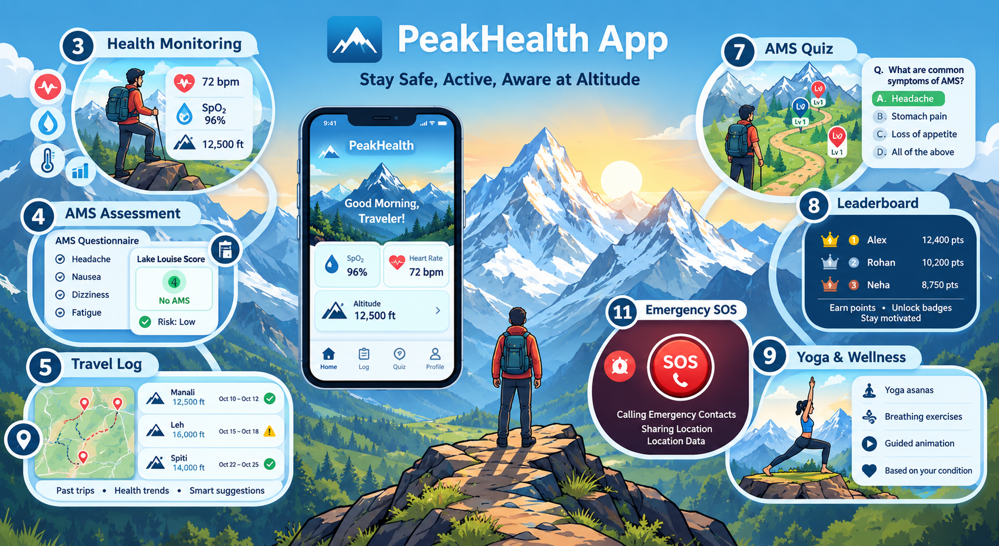

# 🛠️ Tech Stack Used

A carefully curated technology ecosystem powering the mobile experience, backend infrastructure, intelligent health insights, secure data management, and high-altitude wellness capabilities.

---

## Mobile Application

&nbsp;&nbsp;&nbsp;

&nbsp;&nbsp;&nbsp;

&nbsp;&nbsp;&nbsp;

&nbsp;&nbsp;&nbsp;

  

`Flutter` · `Geolocator` · `Google Maps` · `Health Connect` · `Lottie` · `Rive`

| Technology | Purpose |
| --- | --- |
| **Flutter** | Cross-platform mobile application development |
| **Geolocator** | Location services |
| **Google Maps** | Maps and location visualization |
| **Google Health Connect** | Android health data integration |
| **Lottie** | Animations and interactive graphics |
| **Rive** | Interactive animations and visual demonstrations |
| **Flutter Phone Call Integration** | Emergency / SOS calling |
| **Flutter Local Notifications** | Reminders and alerts |
| **Flutter Secure Storage** | Secure local data storage |

---

## Backend

&nbsp;&nbsp;&nbsp;

&nbsp;&nbsp;&nbsp;

  

`Node.js` · `Express.js` · `REST API` · `JSON` · `Mongoose`

| Technology | Purpose |
| --- | --- |
| **Node.js** | Backend runtime environment |
| **Express.js** | REST API and backend framework |
| **REST API** | Frontend–backend communication |
| **JSON** | Data exchange format |
| **Mongoose ODM** | MongoDB object modeling |

---

## Database & Storage

&nbsp;&nbsp;&nbsp;

  

`MongoDB Atlas` · `MongoDB Compass` · `Firebase Cloud Storage`

| Technology | Purpose |
| --- | --- |
| **MongoDB Atlas** | Cloud database |
| **MongoDB Compass** | Database management and visualization |
| **Firebase Cloud Storage** | Cloud-based file storage |

---

## Authentication & Security

&nbsp;&nbsp;&nbsp;

&nbsp;&nbsp;&nbsp;

  

`Firebase Authentication` · `JWT` · `HTTPS` · `Firebase Security`

| Technology | Purpose |
| --- | --- |
| **Firebase Authentication** | User authentication |
| **JWT** | Token-based authorization |
| **HTTPS** | Secure network communication |
| **Firebase Security** | Application and resource security |
| **Flutter Secure Storage** | Secure local data storage |

---

## Machine Learning & Data Processing

&nbsp;&nbsp;&nbsp;

&nbsp;&nbsp;&nbsp;

&nbsp;&nbsp;&nbsp;

&nbsp;&nbsp;&nbsp;

  

`Python` · `Pandas` · `NumPy` · `Scikit-learn` · `Seaborn` · `Jupyter` · `FastAPI`

| Technology | Purpose |
| --- | --- |
| **Python** | Data processing and ML development |
| **Pandas** | Data manipulation |
| **NumPy** | Numerical computation |
| **Scikit-learn** | Machine learning |
| **Seaborn** | Data visualization |
| **Jupyter Notebook** | Data exploration and experimentation |
| **FastAPI** | Machine learning model API integration |

---

## External APIs & Services

&nbsp;&nbsp;&nbsp;

&nbsp;&nbsp;&nbsp;

  

`Weather API` · `News API` · `Google Maps` · `Geolocation` · `Health Connect`

| Service | Purpose |
| --- | --- |
| **Weather API** | Weather and environmental information |
| **News API** | Location-based news and updates |
| **Google Maps** | Mapping and location visualization |
| **Geolocation Services** | Current location and altitude information |
| **Google Health Connect** | Health and wellness data integration |

---

## Health & AMS Logic

### Health Intelligence Layer

`Lake Louise Score` · `AMS Assessment` · `Risk Analysis` · `Travel History` · `ML Pipeline`

| Component | Purpose |
| --- | --- |
| **Lake Louise Scoring Logic** | AMS symptom assessment |
| **AMS Questionnaire** | Structured symptom collection |
| **Risk Assessment Logic** | Interpretation of assessment results |
| **Historical Travel Data** | Personalized health insights |
| **Machine Learning Pipeline** | Future-oriented risk assessment and prediction capabilities |

---

## Development & Testing

&nbsp;&nbsp;&nbsp;

&nbsp;&nbsp;&nbsp;

&nbsp;&nbsp;&nbsp;

&nbsp;&nbsp;&nbsp;

  

`Postman` · `Git` · `GitHub` · `Visual Studio Code` · `Android Studio`

| Tool | Purpose |
| --- | --- |
| **Postman** | API development and testing |
| **Flutter Testing Framework** | Mobile application testing |
| **Git** | Version control |
| **GitHub** | Source code management and collaboration |
| **Visual Studio Code** | Development environment |
| **Android Studio** | Android development and debugging |

 
---

 # App Screenshots

 ### Home Page
 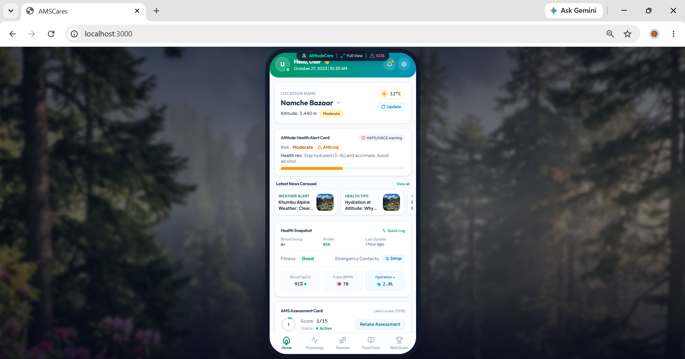
 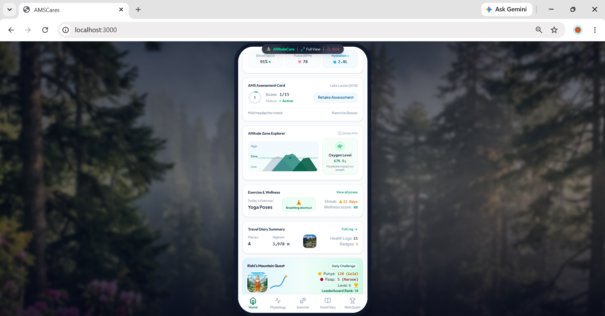
 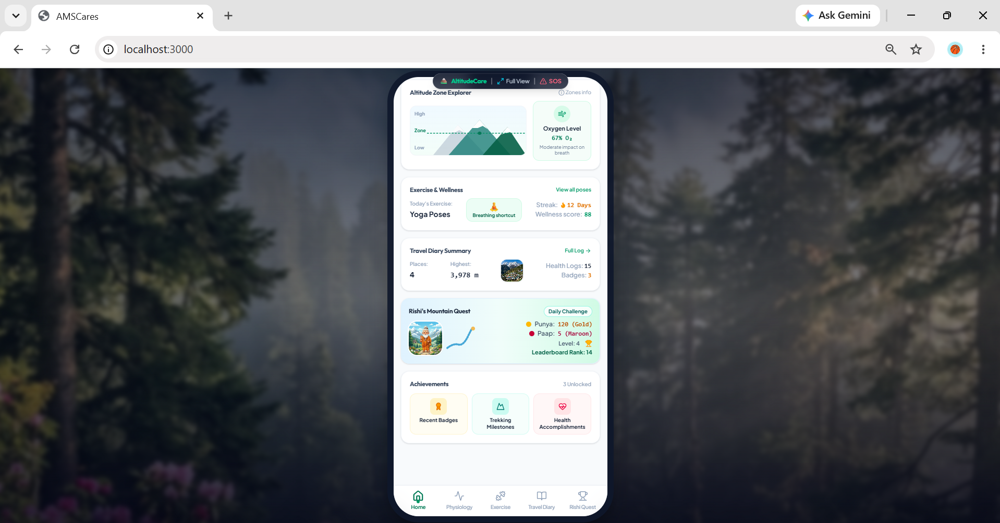
 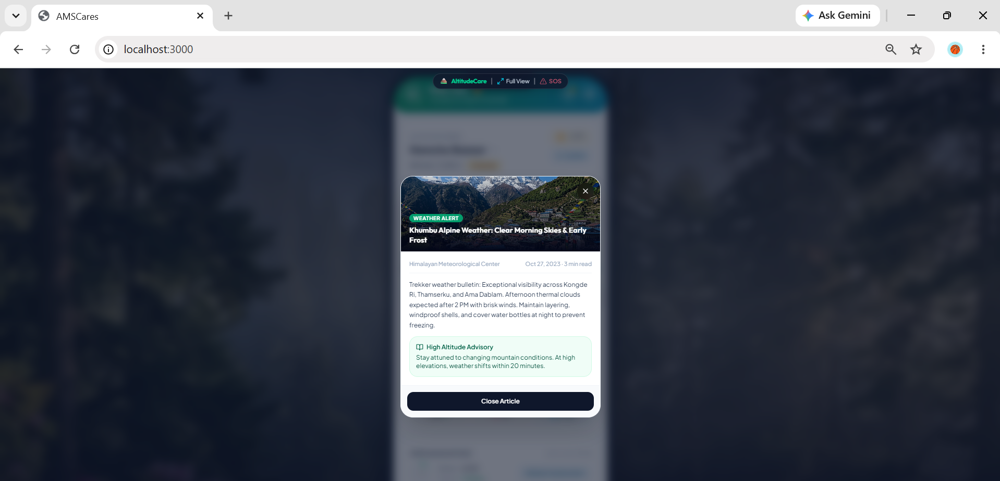
 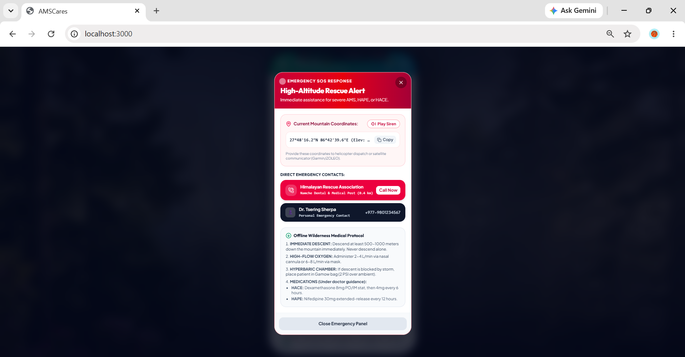
 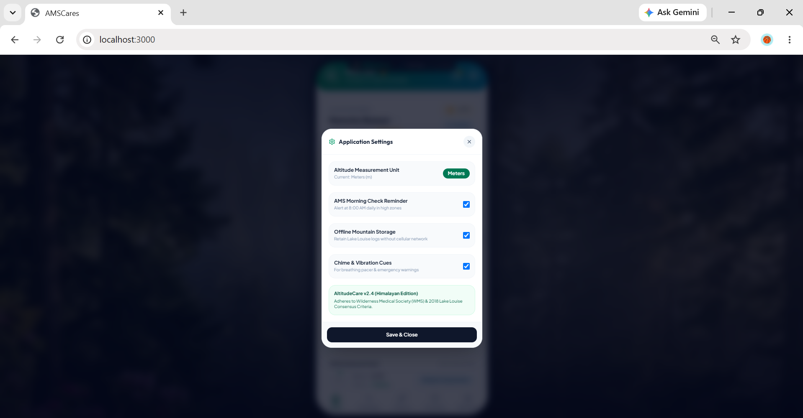

 ### Physiology Page
 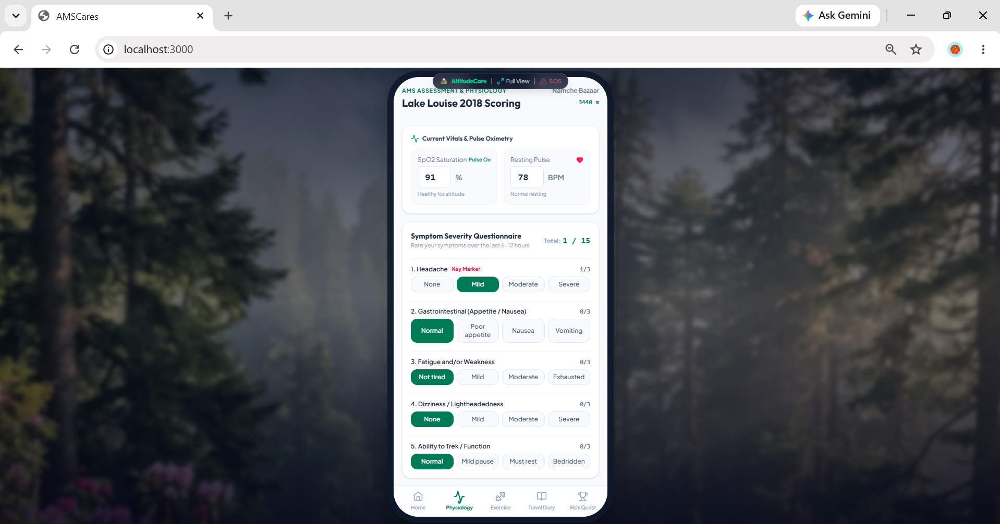
 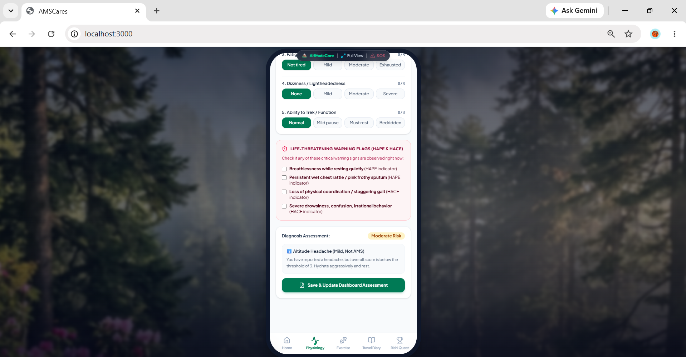

 ### Travel Diary
 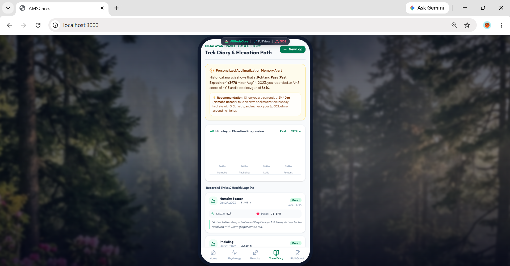
 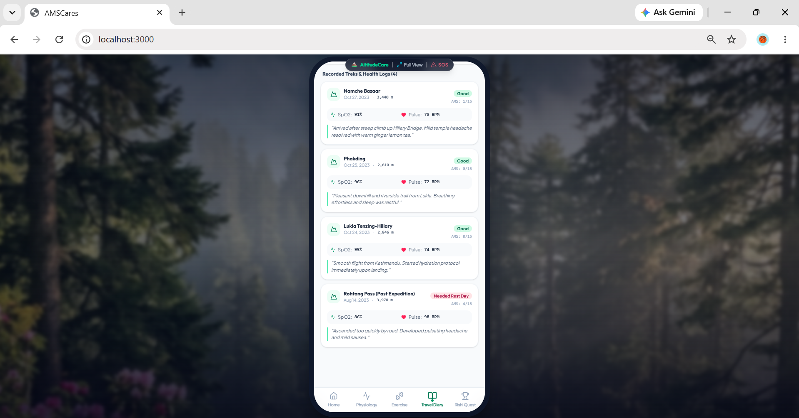

 ### Exercise Demonstrations Page
 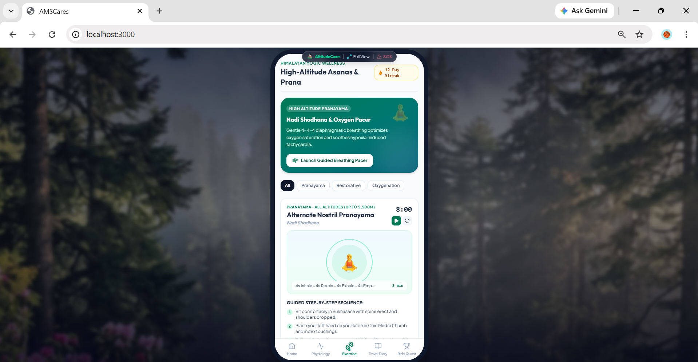
 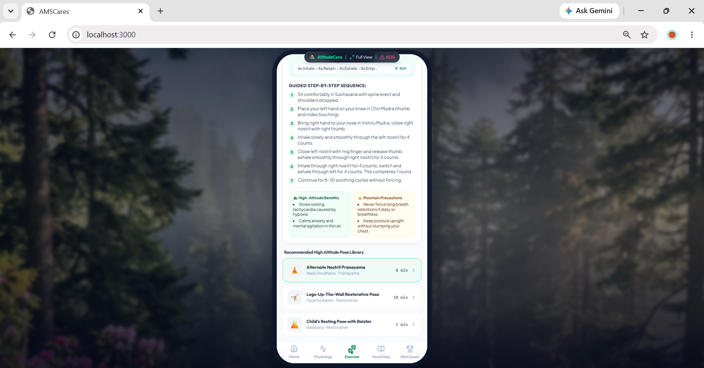
 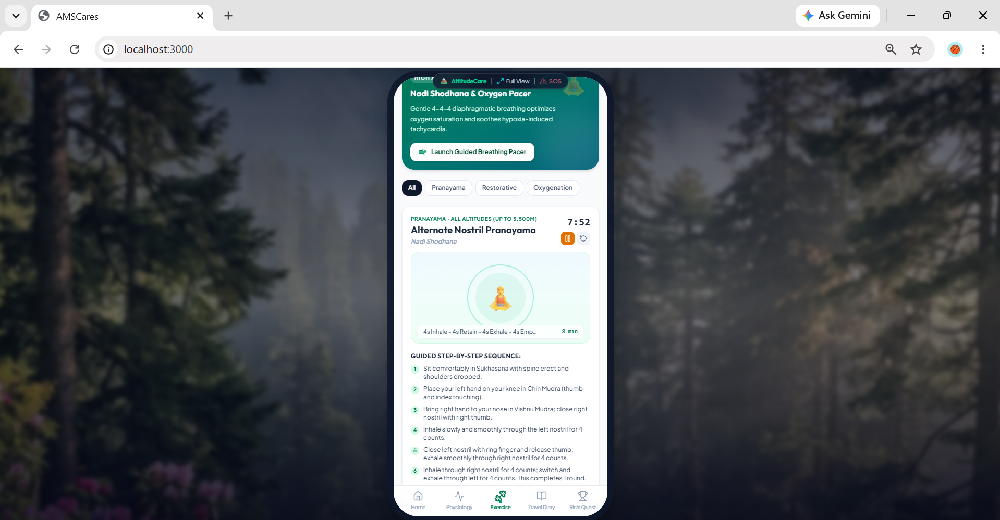

 ### Rishi Based Gamified Awareness Quiz
 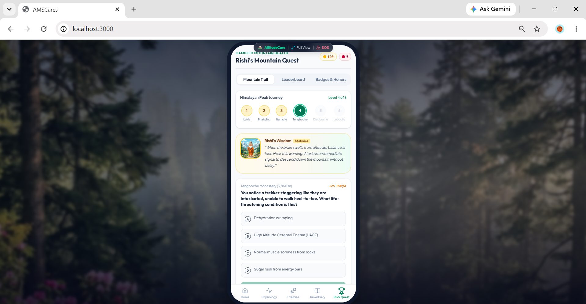
 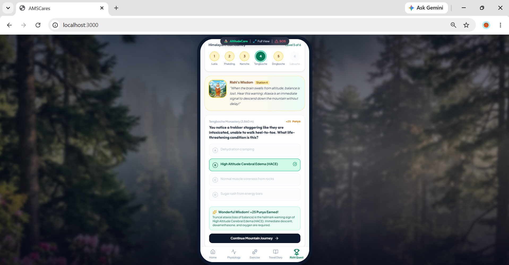
 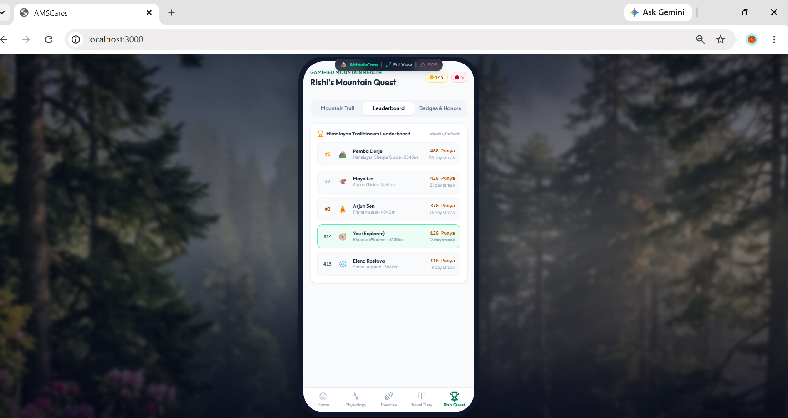
 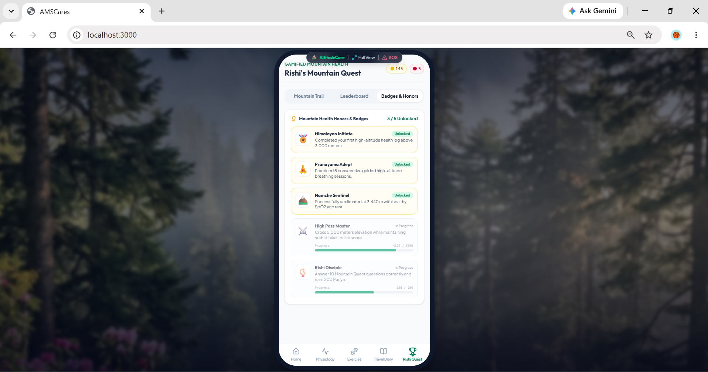

 # 📄 License

 This was the **first** project which had been independently developed by me during my two-months research internship at the **Defence Research and Development Organisation (DRDO), Ministry of Defence, Government of India**. The project is intended for research and educational purposes. **This repository does not represent an official DRDO publication, endorsement or release.**

 Copyright © 2026 **Vamika Arya**

---

 # 👩🏻‍💻 Author

 **Vamika Arya**

 

  

